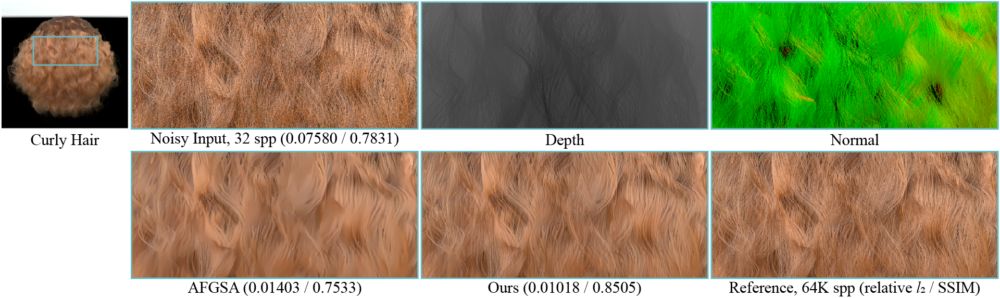
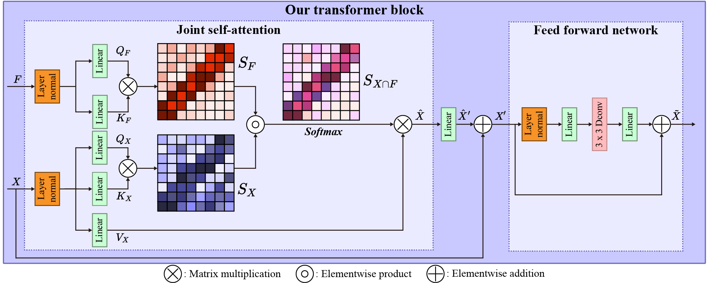

# [Joint Self-Attention for Denoising Monte Carlo Rendering](https://cglab.gist.ac.kr/visualcomputer24jsa/)

[Geunwoo Oh](https://greeny53.notion.site/Geunwoo-Oh-f110abf14321482d9dbc435982faa5ef), [Bochang Moon](https://cglab.gist.ac.kr/people/bochang.html)
 


An official source code of The Visual Computer paper, "Joint Self-Attention for Denoising Monte Carlo Rendering".

For more information, please refer to our project page or other resources below:
* [project page](https://cglab.gist.ac.kr/visualcomputer24jsa/)
* [paper](https://link.springer.com/article/10.1007/s00371-024-03446-8)

<hr />

> **Abstract** *Image-space denoising of rendered images has become a commonly adopted approach since this post-rendering process often drastically reduces required sample counts (thus rendering times) for producing a visually pleasing image without noticeable noise. It is a common practice to conduct such denoising while preserving image details by exploiting auxiliary information (e.g., G-buffers) as well as input colors. However, it is still challenging to devise an ideal denoising framework that fully considers the two inputs with different characteristics, e.g., noisy but complete shading information in the input colors and less noisy but partial shading information in the auxiliary buffers. This paper proposes a transformer-based denoising framework with a new self-attention mechanism that infers a joint self-attention map, i.e., self-similarity in input features, through dual attention scores: one from noisy colors and another from auxiliary buffers. We demonstrate that this separate consideration of the two inputs allows our framework to produce more accurate denoising results than state-of-the-art denoisers for various test scenes.*
<hr />

## Network Architecture
*The overview of our transformer block. Our proposed transformer takes two
		input feature maps, a color feature map $X$ and an auxiliary feature map
		$F$, and extracts dual self-attention scores, $S_X$ from the $X$ and $S_F$ from
		the $F$, to compute the output feature map $\hat{X}$ using the joint
		attention score $S_{X \cap F}=S_X \circ S_F$. 
        We then apply a linear projection to the output feature map and pass it to the feed-forward
		network.*

## Setup
### 1. Environments (tested)
- Unbuntu 18.04
- Pytorch 1.8.1
- GPU: NVIDIA RTX 3090 
  - driver version >= 525
### Requirements
Please install docker and nvidia-docker.
- Installation docker [[guide]](https://docs.docker.com/engine/install/ubuntu/)
- Installation nividia-docker [[guide]](https://docs.nvidia.com/datacenter/cloud-native/container-toolkit/install-guide.html#docker)
### 2. Building docker
1. On a terminal, access the directory located on `Dockerfile` and run a command to build a docker image:

    ```
    docker build -t joint_sa .
    ```
2. After building a docker image, create a container:

    ```
    nvidia-docker run -v ${PWD}/data:/data -v ${PWD}/codes:/codes -it joint_sa;
    ```
    Or, simply run `run_docker.sh`.
    
    ```
    ./run_docker.sh
    ```
## Test with a pre-trained network
1. Setup configurations in `config.py`. Please move example data ([download](https://drive.google.com/file/d/1poySvL50ZVnTCRG3OHesvs8WHjkw1svN/view?usp=drive_link)) to 'data/\_\_test_scenes\_\_/' and pretrained checkpoint ([download](https://drive.google.com/file/d/1OD69MeY6JKq084F3B0krwnOGN-9mAPri/view?usp=drive_link)) to 'data/jsa_pretrained/\_\_checkpoints\_\_/'

    ```    
    # =======================================
    # Dataset
    # =======================================
    config["testDatasetDirectory"] = "../data/__test_scenes__/example"

    config["test_input"] = 'input' 
    config["test_target"] = 'target'
    # =======================================
    # Task
    # =======================================
    config["task"] = 'jsa_pretrained'

    # =======================================
    # Test parameter
    # =======================================
    config["load_epoch"] = "5800" #'jsa_pretrained'

    ```
2. Run a command on the terminal launched container (bash terminal for building docker, `2.2 of Setup`).
   - The result images will be saved in `/data/jsa_pretrained/output_test`.

    ```
    python test.py
    ```

## Retraining
1. Prepare a dataset
    - We generated a training dataset that contains input/reference image pairs with auxiliary buffers (albedo, normal, and depth). 
    - We exploited the [Tungsten renderer](https://github.com/tunabrain/tungsten) and used 32 spp and 32K spp for the input and reference images.
    - The training dataset was generated from [scenes](https://benedikt-bitterli.me/resources/) and we randomly split the training dataset for training and validation.
    - After generating the dataset, please move the training dataset into the training directory (`../data/__train_scenes__/`). For example, please move input data into `input` folder (e.g., `../data/__train_scenes__/example/input`), and reference data into `target` folder (e.g., `../data/__train_scenes__/example/target`). 
2. Setup configurations in `config.py`.

    ```
    # for test using pre-trained checkpoint
    # config["multi_gpu"]  = False  # Please comment out this line, since we are not using a pre-trained net.

    # =======================================
    # Dataset
    # =======================================
    config["DataDirectory"] = "../data"
    config["trainDatasetDirectory"] = "../data/__train_scenes__/example" # folder name to contain training dataset

    config["train_input"] = 'input'
    config["train_target"] = 'target'

    # =======================================
    # Task
    # =======================================
    config["task"] = 'jsa_trained' # folder name to contain training results

    ```
3. Run a command on the terminal (the bash terminal for building docker, `2.2 of Setup`).
   - After training, the result data will be saved in `/data/config['task']`.

    ```
    python main_train.py
    ```


## License

All source codes are released under a BSD License.

## Citation
```
@article{JointSA2024, 
    title={Joint self-attention for denoising Monte Carlo rendering}, 
    author={Oh, Geunwoo and Moon, Bochang}, 
    journal={The Visual Computer}, 
    year={2024}, 
    month={Jun}, 
    issn={1432-2315},
    url={https://doi.org/10.1007/s00371-024-03446-8}, 
    DOI={10.1007/s00371-024-03446-8}, 
    abstractNote={Image-space denoising of rendered images has become a commonly adopted approach since this post-rendering process often drastically reduces required sample counts (thus rendering times) for producing a visually pleasing image without noticeable noise. It is a common practice to conduct such denoising while preserving image details by exploiting auxiliary information (e.g., G-buffers) as well as input colors. However, it is still challenging to devise an ideal denoising framework that fully considers the two inputs with different characteristics, e.g., noisy but complete shading information in the input colors and less noisy but partial shading information in the auxiliary buffers. This paper proposes a transformer-based denoising framework with a new self-attention mechanism that infers a joint self-attention map, i.e., self-similarity in input features, through dual attention scores: one from noisy colors and another from auxiliary buffers. We demonstrate that this separate consideration of the two inputs allows our framework to produce more accurate denoising results than state-of-the-art denoisers for various test scenes.}
}
```


## Contact

If you have any questions, issues, and comments, please feel free to contact [gnuo8325@gm.gist.ac.kr](mailto:gnuo8325@gm.gist.ac.kr).
